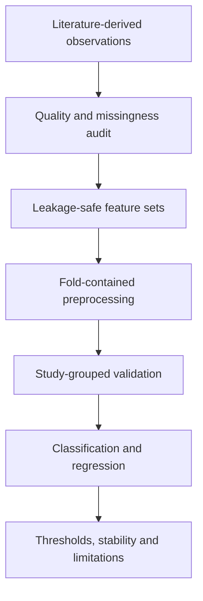

# Nanomaterial Toxicity Prediction with Machine Learning

[](https://www.python.org/)
[](https://scikit-learn.org/)
[](#)
[](LICENSE)

An end-to-end biomedical machine-learning portfolio project for predicting **metal-oxide nanoparticle cytotoxicity** and continuous **cell viability** from physicochemical, biological, assay, dose, and exposure descriptors.

This repository documents work completed by **Hassan Tariq** using two processing stages of a literature-derived nanotoxicology dataset. It demonstrates data-quality auditing, leakage-safe preprocessing, imbalanced classification, regression, study-grouped validation, model comparison, threshold analysis, and responsible scientific interpretation.

> **Research-use statement:** This is a validated baseline and screening workflow—not a clinical, toxicological, regulatory, or laboratory decision system. Predictions require independent experimental confirmation.

## Why this project matters

Nanotoxicology datasets combine evidence from different laboratories, assays, cell systems, materials, doses, and exposure protocols. A random row-level split can place observations from the same publication in both training and validation data, producing overly optimistic estimates. This project therefore groups validation by **PubMed source study**, testing whether models generalize to unseen studies.

## Questions addressed

1. Can toxicity below a 50% viability boundary be predicted without leaking the viability endpoint?
2. Can continuous cell viability be estimated from available experimental descriptors?
3. Does a smaller, more curated dataset outperform a larger but noisier version?
4. How stable are results across unseen source-study groups?
5. What precision–recall trade-offs matter for toxicity screening?

## Dataset profile

| Dataset | Rows | Toxic observations | Toxic prevalence | Interpretation |
|---|---:|---:|---:|---|
| Version I | 6,842 | 1,059 | 15.5% | Larger and noisier; weaker measurement-method metadata |
| Version II | 3,246 | 414 | 12.8% | Smaller, more curated processing stage |

Version II overlaps with Version I; it is **not an independent external test set**. Their comparison primarily evaluates the effect of curation.

## Leakage controls

- **Toxicity classification:** cell viability is excluded because toxicity is derived from viability.
- **Viability regression:** toxicity is excluded because it reveals the thresholded target.
- **Study identifier:** PubMed ID is used only as a validation group, never as a predictor.
- Imputation, transformation, encoding, scaling, and model fitting occur inside each training fold.

## Modelling workflow



### Models compared

| Classification | Regression |
|---|---|
| Balanced Logistic Regression | Ridge Regression |
| K-Nearest Neighbours | Random Forest Regressor |
| Random Forest | XGBoost Regressor |
| XGBoost | |

## Headline results

| Task | Version I | Version II |
|---|---|---|
| Best classification model | XGBoost | Random Forest |
| Best mean F1 | 0.470 | 0.590 |
| Best regression model | XGBoost | Random Forest |
| Best MAE | 16.789 viability points | 16.151 viability points |

For the selected Version I grouped out-of-fold classifier at threshold 0.50:

| Precision | Recall | F1 | True positives | False positives | False negatives |
|---:|---:|---:|---:|---:|---:|
| 0.374 | 0.630 | 0.469 | 667 | 1,118 | 392 |

The modest F1 scores are scientifically informative. They reflect class imbalance, cross-study heterogeneity, underrepresented materials and biological systems, missing provenance metadata, and difficult observations near the viability threshold.

## Repository contents

```text
.
├── README.md
├── LICENSE
├── CITATION.cff
├── requirements.txt
├── data/README.md
├── dashboard/README.md
├── docs/
│   ├── methodology.md
│   ├── results-and-interpretation.md
│   └── project-walkthrough.md
└── notebooks/
    ├── metal_oxide_toxicity_full_pipeline.ipynb
    └── synthetic_demo_pipeline.ipynb
```

## Run the notebooks

```bash
python -m venv .venv
pip install -r requirements.txt
jupyter lab
```

- Open `notebooks/synthetic_demo_pipeline.ipynb` for a self-contained runnable demonstration.
- The full pipeline expects the two source spreadsheets described in `data/README.md`.
- Numerical results reported above come from the original study-grouped analysis, not from synthetic data.

## Skills demonstrated

- Biomedical and nanotoxicology data interpretation
- Python, pandas, NumPy, Matplotlib and Seaborn
- scikit-learn pipelines and XGBoost
- Missing-data and high-cardinality feature handling
- Imbalanced classification and threshold analysis
- Study-aware cross-validation and leakage prevention
- Regression diagnostics and fold-level stability
- Reproducible notebooks and stakeholder-facing dashboards
- Responsible AI communication for medical research

## Author

**Hassan Tariq**  
M.Sc. student, Hamad Bin Khalifa University  
Machine-learning and responsible-AI researcher based in Doha, Qatar  
GitHub: [@HassanTariqQCRI](https://github.com/HassanTariqQCRI)

## Responsible use

This repository is intended for education, research discussion, and portfolio review. It does not provide medical advice, certify nanoparticle safety, or replace laboratory testing, toxicological assessment, or regulatory review.
